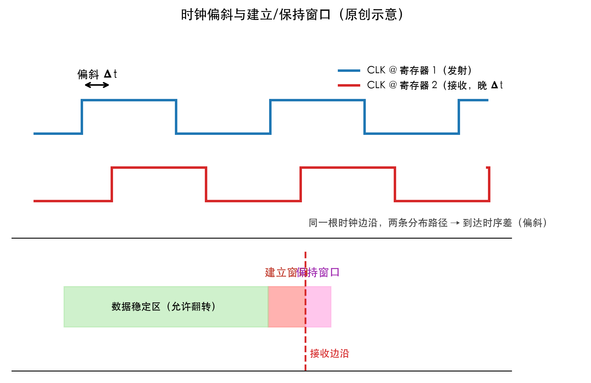
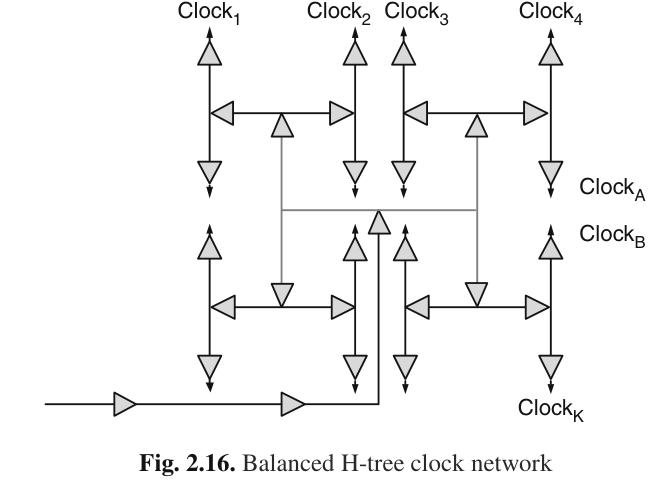
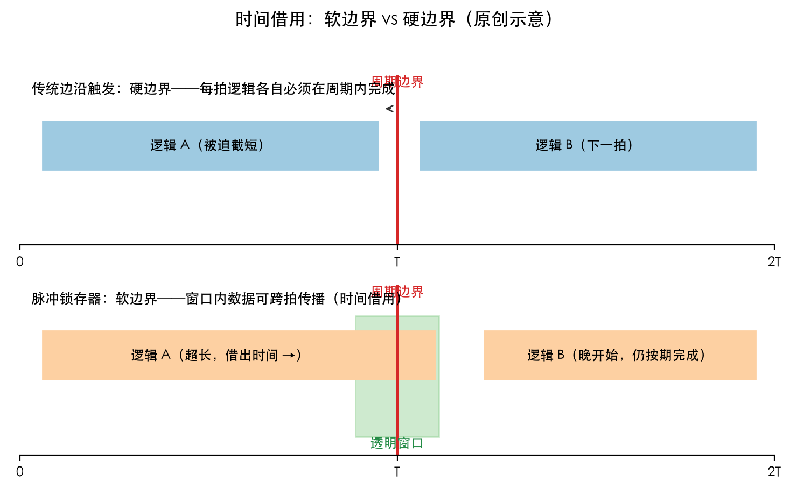
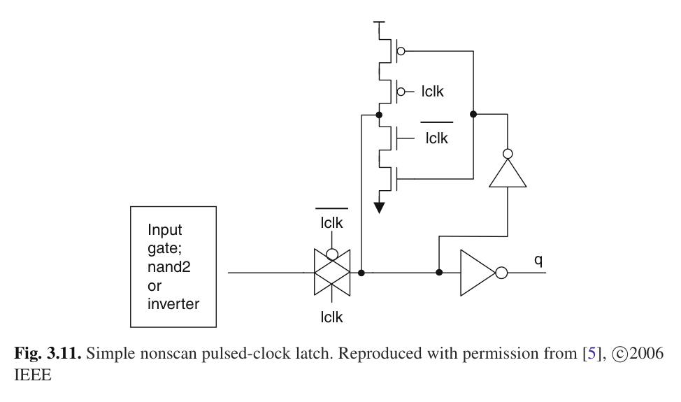

# 从时钟偏斜到时间借用：数字时序的三步

> 原创笔记 · 生成日期：2026-10-07 · 知识源：私有知识库（Knowledge Pipeline）

从你已会的**时钟偏斜**出发：你已经知道它是"静态"的时钟不确定性——同一根时钟边沿到达两个寄存器的平均到达时间之差，实证分解显示器件失配是主导因素，商用处理器的最坏偏斜约占周期时间的 4.5–5%。这一篇沿这条路再走三步：偏斜如何与时钟抖动合流、如何从两侧挤压时序约束，以及设计者的最后一手反打——不硬扛偏斜，而是把周期边界变软，主动"借时间"。

**第一步：静态与动态合流。** 偏斜的孪生兄弟是**时钟抖动**——单个边沿相对理想参考的峰峰摆动，主导来源是电源压降与动态电压波动，峰峰值平均侵蚀约 5.5% 的有效周期。两者统计结构同源：时钟分布路径的缓冲级数越多，标准差按平方根增长，所以缩短分布延迟在任何拓扑下都是首要目标。二者合称 clock uncertainty，是同步时序的头号敌人。缩短与平衡分布路径的经典答案是 H 树：结构对称使根到各分支的标称延迟相等，结构性偏斜可为零。

**第二步：双边挤压。** **建立与保持时序约束**是一对双边约束：建立（MAX delay）一侧，可用传播时间先被 uncertainty 削掉一块；保持（MIN delay）一侧，快路径的新数据在 uncertainty 推波助澜下，可能把本拍该收的旧数据提前冲掉。更麻烦的是耦合——为满足保持而垫充的延迟，可能反过来打破建立预算。硬扛的办法在分布侧：**时钟去偏斜**用可调延迟线加鉴相器做后硅闭环校准，商用处理器实测能把 60ps 压到 15ps。

**第三步：把边界变软。** 与其消灭 uncertainty，不如让周期边界容忍它——**时间借用**（cycle stealing / 用剩时间借用）：电平敏感锁存器在透明窗口内导通，晚到的数据只要落在窗口里就能继续传播，等效把本周期装不下的逻辑摊给下一周期。Rabaey 的讲法（ch10，图 10.28–10.29）：锁存式设计允许周期边界之间的逻辑使用比一个周期更长的时间，同时仍满足对周期时间的总限制——时钟速率因此可以高于最坏情况的关键路径。全局时钟侧的同族思想是"有意偏斜"：为借时而故意错开时钟到达时间。

工程落点有三条：纯两相电平敏感锁存器软边界最彻底，但时序分析复杂、扫描开销大，始终未在大规模高速处理器普及；**主从锁存器**的重叠时钟给出可调窗口，代价是保持时间上升；**脉冲锁存器**则用单相脉冲写一个简单锁存器——活动时钟砍掉约一半、钟功耗近乎减半，但脉宽成了生死参数：太窄写不进，太宽保持恶化，实用上限约周期的 1/4–1/3，透明窗口的下限被最小可写脉宽锁死。变差越大的工艺世代，软边界越值钱。

一条线收束：偏斜与抖动吃掉周期预算 → 建立与保持双边受挤 → 硬扛（去偏斜）或软化（时间借用）→ 软化的主流形态是重叠钟 MSL 与脉冲锁存器。下次翻概念卡时，试着把这条链自己走一遍。

## 出处

- Clocking in Modern VLSI Systems · ch02（Sect. 2.2/2.2.1 双边约束、Sect. 2.2.2/2.2.3 偏斜与抖动及统计模型、Sect. 2.5 主动去偏斜实测数据）
- Clocking in Modern VLSI Systems · ch03（Sect. 3.2.1 软/硬周期边界、Sect. 3.3.1 主从锁存器重叠钟、Sect. 3.3.3 脉冲锁存器）
- 《数字集成电路：电路、系统与设计（第二版）》· ch10（数字电路中的时序问题：时钟抖动指标、锁存式设计与用剩时间借用，图 10.28–10.29）
- 概念页：时钟偏斜 / 时钟抖动 / 建立与保持时序约束 / 时钟去偏斜 / 时间借用 / 主从锁存器 / 脉冲锁存器

## 图源

- assets/从时钟偏斜到时间借用/clock-skew-setup-hold.png：原创示意（matplotlib 绘制，自概念笔记综合理解，非仿描原图）
- assets/从时钟偏斜到时间借用/clocking-fig2-16-htree.png：图源：Clocking in Modern VLSI Systems (Xanthopoulos), Fig 2.16, p.23
- assets/从时钟偏斜到时间借用/time-borrowing-soft-boundary.png：原创示意（matplotlib 绘制，自概念笔记综合理解，非仿描原图）
- assets/从时钟偏斜到时间借用/clocking-fig3-11-pulsed-latch.png：图源：Clocking in Modern VLSI Systems (Xanthopoulos), Fig 3.11, p.78（原书注明 Reproduced with permission, © 2006 IEEE）
